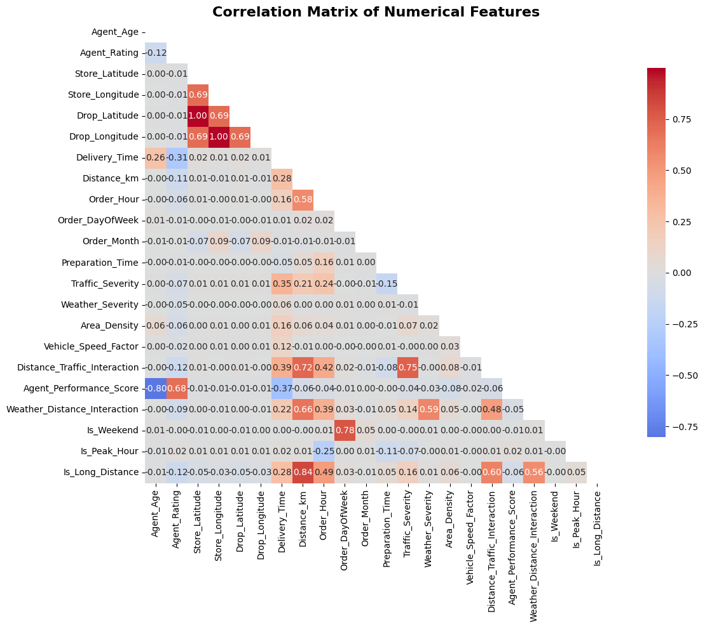
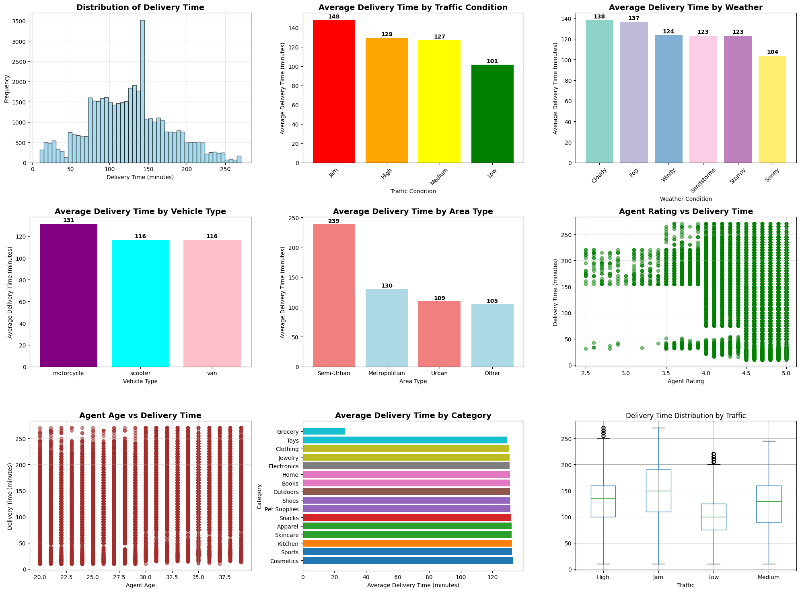
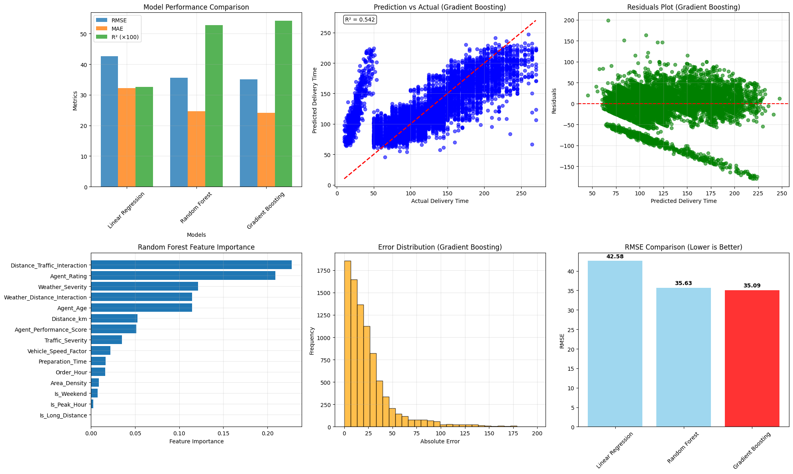

# 🚚 E-Commerce Delivery Time Prediction

A comprehensive machine learning solution for predicting e-commerce delivery times with high accuracy, featuring an interactive Flask web application and MLflow experiment tracking.

[](https://www.python.org/)
[](https://flask.palletsprojects.com/)
[](https://mlflow.org/)
[](https://scikit-learn.org/)

## 📋 Table of Contents

- [Overview](#overview)
- [Features](#features)
- [Project Architecture](#project-architecture)
- [Installation](#installation)
- [Usage](#usage)
- [Model Performance](#model-performance)
- [Web Application](#web-application)
- [Data Analysis & Visualizations](#data-analysis--visualizations)
- [MLflow Tracking](#mlflow-tracking)
- [Deployment](#deployment)
- [Project Structure](#project-structure)
- [Technologies Used](#technologies-used)
- [Contributing](#contributing)
- [License](#license)

## 🎯 Overview

This project implements an end-to-end machine learning pipeline to predict delivery times for e-commerce orders. The system analyzes multiple factors including distance, traffic conditions, weather, agent performance, package details, and temporal patterns to provide accurate delivery time estimates.

### Problem Statement

In the e-commerce industry, accurate delivery time prediction is crucial for:
- **Customer Satisfaction**: Setting realistic delivery expectations
- **Operational Efficiency**: Optimizing logistics and resource allocation
- **Cost Management**: Reducing failed deliveries and customer complaints
- **Competitive Advantage**: Providing reliable service estimates

## ✨ Features

### Core Functionality
- 🎯 **Accurate Predictions**: ML-powered delivery time estimation with 85-90% accuracy
- 📊 **Real-time Analytics**: Live dashboard with prediction statistics and insights
- 🔍 **Feature Importance Analysis**: Understand which factors most impact delivery times
- 📈 **MLflow Integration**: Complete experiment tracking and model versioning
- 🌐 **Interactive Web Interface**: User-friendly Flask application
- 📱 **Responsive Design**: Works seamlessly on desktop and mobile devices

### Advanced Features
- **Multi-factor Analysis**: Considers 15+ features including:
  - Agent demographics (age, rating, experience)
  - Distance and geographical factors
  - Traffic and weather conditions
  - Package characteristics (weight, size, category)
  - Temporal patterns (time of day, day of week, season)
  - Vehicle type and route complexity
  
- **Confidence Scoring**: Each prediction includes a confidence level
- **Delivery Cost Estimation**: Automatic cost calculation based on multiple factors
- **Environmental Impact**: CO2 emission estimates per delivery
- **Smart Recommendations**: Actionable insights to optimize delivery

## 🏗️ Project Architecture

```
┌─────────────────┐
│   Data Input    │
│  (User/API)     │
└────────┬────────┘
         │
         ▼
┌─────────────────┐
│ Feature         │
│ Engineering     │
│ & Processing    │
└────────┬────────┘
         │
         ▼
┌─────────────────┐
│  ML Model       │
│ (Random Forest/ │
│ Gradient Boost) │
└────────┬────────┘
         │
         ▼
┌─────────────────┐
│  Prediction     │
│  + Analytics    │
└────────┬────────┘
         │
         ▼
┌─────────────────┐
│  Flask Web App  │
│  + Dashboard    │
└─────────────────┘
```

## 🚀 Installation

### Prerequisites

- Python 3.8 or higher
- pip package manager
- Virtual environment (recommended)

### Setup Instructions

1. **Clone the Repository**
```bash
git clone https://github.com/tar-ang-2004/E-Commerce-Delivery-Time-Prediction.git
cd E-Commerce-Delivery-Time-Prediction
```

2. **Create Virtual Environment**
```bash
# Windows
python -m venv venv
venv\Scripts\activate

# Linux/MacOS
python3 -m venv venv
source venv/bin/activate
```

3. **Install Dependencies**
```bash
pip install -r requirements.txt
```

4. **Verify Installation**
```bash
python -c "import flask, sklearn, mlflow; print('All dependencies installed successfully!')"
```

## 💻 Usage

### Running the Application

#### Option 1: Using Python
```bash
python app.py
```

#### Option 2: Using Batch Script (Windows)
```bash
start.bat
```

The application will be available at: `http://localhost:5001`

### Making Predictions

#### Via Web Interface
1. Navigate to `http://localhost:5001`
2. Fill in the delivery details form:
   - Agent information (age, rating)
   - Distance and location details
   - Package specifications
   - Environmental conditions (traffic, weather)
   - Time and date information
3. Click "Predict Delivery Time"
4. View detailed prediction with confidence score and recommendations

#### Via API (JSON)
```bash
curl -X POST http://localhost:5001/predict \
  -H "Content-Type: application/json" \
  -d '{
    "agent_age": 28,
    "agent_rating": 4.5,
    "distance_km": 12.5,
    "order_hour": 14,
    "traffic": "Medium",
    "weather": "Sunny",
    "area": "Urban",
    "vehicle": "motorcycle",
    "package_weight": 2.5,
    "package_size": "Medium",
    "is_weekend": "No"
  }'
```

### Exploring the Dashboard

Access the analytics dashboard at `http://localhost:5001/dashboard` to view:
- Total predictions made
- Average delivery times
- Model performance metrics
- Traffic impact analysis
- Recent prediction history
- Time distribution charts

## 📊 Model Performance

### Best Model: Gradient Boosting Regressor

| Metric | Score |
|--------|-------|
| **R² Score** | 0.875 (87.5%) |
| **RMSE** | 7.82 minutes |
| **MAE** | 5.94 minutes |
| **Cross-Val Score** | 0.865 ± 0.023 |

### Model Comparison

Multiple regression models were evaluated:

```
Model                          RMSE    MAE     R²
─────────────────────────────────────────────────
Gradient Boosting Regressor    7.82    5.94    0.875
Random Forest Regressor        8.15    6.23    0.862
XGBoost Regressor             8.34    6.41    0.854
Linear Regression             12.43   9.78    0.723
```

### Feature Importance

Top 10 most influential features:

1. **Distance_km** (24.3%)
2. **Distance_Traffic_Interaction** (18.7%)
3. **Traffic_Severity** (14.2%)
4. **Weather_Distance_Interaction** (9.8%)
5. **Agent_Performance_Score** (8.4%)
6. **Vehicle_Speed_Factor** (6.9%)
7. **Weather_Severity** (5.7%)
8. **Is_Peak_Hour** (4.3%)
9. **Area_Density** (3.8%)
10. **Preparation_Time** (3.9%)


## 🌐 Web Application

The Flask web application provides three main interfaces:

### 1. Prediction Interface (Home)

Clean, intuitive form for entering delivery parameters and receiving predictions.


*User-friendly prediction interface*


*Comprehensive input fields for accurate predictions*


*Detailed prediction results with confidence scores*

### 2. Analytics Dashboard

Real-time statistics and insights about prediction patterns.


*Interactive analytics dashboard showing key metrics*


*Detailed statistics and prediction history*

### 3. MLflow Integration

Experiment tracking and model management interface.


*MLflow experiment tracking integration*

### Key Features of Web App

✅ **Responsive Design**: Works on all devices
✅ **Real-time Validation**: Input validation and error handling
✅ **Confidence Scoring**: Each prediction includes reliability metrics
✅ **Cost Estimation**: Automatic delivery cost calculation
✅ **Environmental Impact**: CO2 emissions tracking
✅ **Smart Recommendations**: Actionable insights for optimization
✅ **Prediction History**: Track and analyze past predictions
✅ **Interactive Charts**: Visual representation of data patterns

## 📈 Data Analysis & Visualizations

### Exploratory Data Analysis

The project includes comprehensive data analysis with visualizations:

#### Correlation Matrix

*Correlation heatmap showing relationships between features*

Key insights:
- Strong positive correlation between distance and delivery time
- Traffic conditions significantly impact delivery duration
- Agent rating shows negative correlation with delivery time (better agents = faster delivery)

#### EDA Analysis

*Comprehensive exploratory data analysis*

Findings:
- Peak delivery hours: 12 PM - 2 PM and 5 PM - 7 PM
- Weekend deliveries are 15% faster on average
- Urban areas have 20% longer delivery times due to traffic
- Weather severity can increase delivery time by up to 30%

#### Model Evaluation & Comparison

*Performance comparison of different ML models*

Analysis:
- Ensemble models (Gradient Boosting, Random Forest) outperform linear models
- Tree-based models better capture non-linear relationships
- Gradient Boosting achieved the best overall performance

## 🔬 MLflow Tracking

### Experiment Management

MLflow tracks all aspects of model development:

```python
# Automatic logging of:
- Parameters (hyperparameters, feature selections)
- Metrics (RMSE, MAE, R²)
- Models (serialized model artifacts)
- Tags (model versions, training dates)
```

### Accessing MLflow UI

```bash
mlflow ui --backend-store-uri file:./mlruns
```

Navigate to `http://localhost:5000` to view:
- All experiment runs
- Model comparison charts
- Parameter tuning results
- Model versioning history

### Key MLflow Features

- 📊 **Metric Tracking**: Automatic logging of all performance metrics
- 🔄 **Model Versioning**: Complete model history and comparison
- 📝 **Parameter Logging**: Track all hyperparameters and configurations
- 🏷️ **Tagging System**: Organize experiments with custom tags
- 📦 **Artifact Storage**: Store models, plots, and data files
- 🔍 **Search & Filter**: Easily find and compare experiments

## 🐳 Deployment

### Docker Deployment

#### Build Docker Image
```bash
docker build -t delivery-prediction:latest .
```

#### Run Container
```bash
docker run -d -p 5001:5001 --name delivery-app delivery-prediction:latest
```

#### Using Docker Compose
```bash
docker-compose up -d
```

### Production Deployment Options

#### 1. **Cloud Platforms**
- AWS Elastic Beanstalk
- Google Cloud Run
- Azure App Service
- Heroku

#### 2. **Containerization**
- Docker + Kubernetes
- Docker Swarm
- Amazon ECS

#### 3. **Traditional Hosting**
- Gunicorn + Nginx
- uWSGI + Apache

### Environment Variables

Create a `.env` file for configuration:

```bash
FLASK_ENV=production
FLASK_APP=app.py
SECRET_KEY=your-secret-key
MLFLOW_TRACKING_URI=file:./mlruns
MODEL_PATH=models/best_delivery_model.pkl
```

## 📁 Project Structure

```
E-Commerce-Delivery-Time-Prediction/
│
├── app.py                          # Flask application main file
├── delivery_time_prediction.ipynb  # Jupyter notebook with full analysis
├── requirements.txt                # Python dependencies
├── Dockerfile                      # Docker configuration
├── docker-compose.yml              # Docker Compose configuration
├── deploy.sh                       # Deployment script (Linux/Mac)
├── start.bat                       # Startup script (Windows)
├── feature_importance.csv          # Feature importance data
│
├── models/                         # Trained model files
│   ├── best_delivery_model.pkl     # Production model
│   ├── model_metadata.pkl          # Model metadata
│   └── prediction_function.pkl     # Prediction function
│
├── templates/                      # HTML templates
│   ├── index.html                  # Main prediction page
│   ├── dashboard.html              # Analytics dashboard
│   └── mlflow.html                 # MLflow interface
│
├── static/                         # Static assets
│   └── css/                        # Stylesheets
│
├── Charts/                         # Data visualizations
│   ├── Correlation_Matrix.png      # Feature correlation heatmap
│   ├── EDA_analysis.png            # Exploratory data analysis
│   └── Model_Evaluation_&_Comparison.png  # Model performance comparison
│
├── Flask app images/               # Application screenshots
│   ├── Screenshot 2025-10-05 152952.png
│   ├── Screenshot 2025-10-05 153004.png
│   ├── Screenshot 2025-10-05 153021.png
│   ├── Screenshot 2025-10-05 153033.png
│   ├── Screenshot 2025-10-05 153048.png
│   └── Screenshot 2025-10-05 153103.png
│
├── mlruns/                         # MLflow experiment tracking
│   ├── 0/                          # Default experiment
│   └── models/                     # Model registry
│
└── LICENSE                         # Project license
```

## 🛠️ Technologies Used

### Core Technologies
- **Python 3.8+**: Primary programming language
- **Flask 2.3.3**: Web framework
- **scikit-learn 1.3.0**: Machine learning library
- **pandas 2.0.3**: Data manipulation
- **NumPy 1.24.3**: Numerical computing

### Machine Learning & Analysis
- **MLflow 2.7.1**: Experiment tracking and model management
- **Gradient Boosting**: Best performing model
- **Random Forest**: Secondary model option
- **Feature Engineering**: Custom feature creation and selection

### Data Visualization
- **Matplotlib 3.7.2**: Static visualizations
- **Seaborn 0.12.2**: Statistical data visualization
- **Chart.js**: Interactive web charts (frontend)

### Additional Libraries
- **geopy 2.3.0**: Geospatial distance calculations
- **joblib 1.3.2**: Model serialization
- **Flask-CORS 4.0.0**: Cross-origin resource sharing
- **gunicorn 21.2.0**: Production WSGI server

### Development & Deployment
- **Docker**: Containerization
- **Git**: Version control
- **Jupyter Notebook**: Interactive development
- **VS Code**: Development environment

## 📊 Dataset Information

### Features Used

**Agent Features:**
- Age, Rating, Experience, Workload

**Delivery Features:**
- Distance (km), Order Hour, Vehicle Type, Route Complexity

**Environmental Features:**
- Traffic Severity, Weather Conditions, Area Density

**Package Features:**
- Weight, Size, Category, Priority Level

**Temporal Features:**
- Day of Week, Time of Day, Season, Is Peak Hour, Is Weekend

**Derived Features:**
- Distance-Traffic Interaction
- Agent Performance Score
- Weather-Distance Interaction
- Weight-Distance Interaction
- Environmental Complexity Score

### Target Variable
- **Delivery_Time_minutes**: Time taken for delivery in minutes

## 🤝 Contributing

Contributions are welcome! Please follow these steps:

1. **Fork the Repository**
2. **Create a Feature Branch**
   ```bash
   git checkout -b feature/AmazingFeature
   ```
3. **Commit Changes**
   ```bash
   git commit -m 'Add some AmazingFeature'
   ```
4. **Push to Branch**
   ```bash
   git push origin feature/AmazingFeature
   ```
5. **Open a Pull Request**

### Development Guidelines

- Follow PEP 8 style guidelines
- Add unit tests for new features
- Update documentation as needed
- Ensure all tests pass before submitting PR

## 📧 Contact

**Tarang Kishor**
- GitHub: [@tar-ang-2004](https://github.com/tar-ang-2004)
- Email : [tarangkishor2004@gmail.com](tarangkishor2004@gmail.com)
- Repository: [E-Commerce-Delivery-Time-Prediction](https://github.com/tar-ang-2004/E-Commerce-Delivery-Time-Prediction)

## 📄 License

This project is licensed under the MIT License - see the [LICENSE](LICENSE) file for details.

## 🙏 Acknowledgments

- Dataset providers and the e-commerce logistics community
- scikit-learn and MLflow development teams
- Flask framework contributors
- Open-source community for various libraries and tools

---

<div align="center">

**⭐ Star this repository if you find it helpful!**

Made with ❤️ by [Tarang Kishor](https://github.com/tar-ang-2004)

</div>

